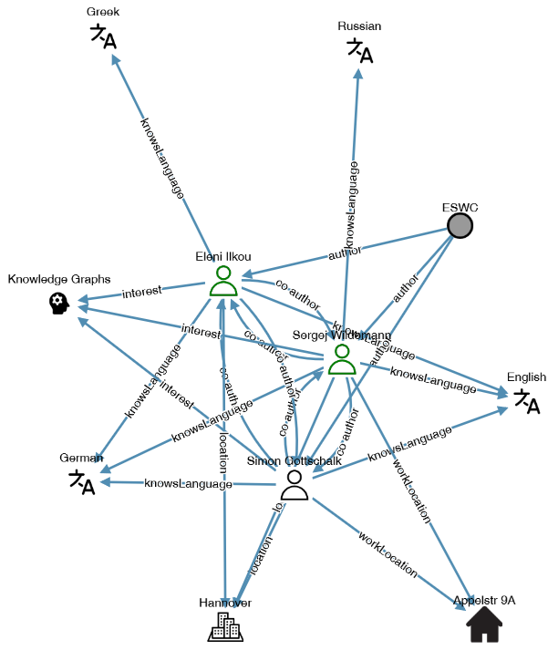

# Research-Institute KG

This is the repository for creating and accessing a Research Institute Knowledge Graph (KG).

## Description

We provide a process for creating a research institute KG for internal organisation, to accommodate its members needs and to foster collaborations. 
We create such a knowledge graph from public and internal resources and demonstrate its benefits via use cases and access methods.
For more information, see [https://sgottsch.github.io/research-institute-kg-demo/](https://sgottsch.github.io/research-institute-kg-demo/).

## Structure of this repository

This repository contains two projects:
1. [kgcreation](kgcreation): The KG creation pipeline and an example KG.
2. [institute_kg](institute_kg): The website to interact with a research institute KG.

# Usage

These are the stepts required to create your own research institute KG and to interact with it:

1. Install requirements as in requirements.txt.
2. (optional) Run the website for a first test (see Website).
3. Make configurations specific to your research institute (see Configuration).
4. Create your research institute KG (see KG Creation Pipeline).
5. Run the website to interact with your research institute KG (see Website).

Details are given in the following.

# Configuration

To make configurations specific to your research institute, you need to edit the file [config.py](config.py). The required changes are documented in the file. For most variables, we give examples based on the L3S Research Center.

Further changes:
- Edit the prefix in [kg_creation/rdf/InstO](kg_creation/rdf/InstO) to the same as ``institute_ontology_prefix`` in [config.py](config.py).
- Several parts in the code refer to institute-specific positions such as ``PhD Student`` and ``Research Group Leader``. If you want to use more positions, you need to update different files:
 - [institute_kg/kgview/index.html](institute_kg/kgview/index.html) (for the website; to display different positions in different colours)
 - [kg_creation/rdf/InstO.py](kg_creation/rdf/InstO.py)

# KG Creation Pipeline

Run [kg_creation/kg_creation.py](kg_creation/kg_creation.py) to create your own research institute KG as a .ttl file.

It currently uses extractors on the following sources:
- dblp
- Google Scholar
- Wikidata
- Google Forms
- Insitute website

You can add additional extractors (call them in [kg_creation/kg_creation.py](kg_creation/kg_creation.py)) and edit [kgcreation/extractors/institute_website_parser.py](kgcreation/extractors/institute_website_parser.py) to parse data from our own research institute's website.

## Google Forms Questionnaire

Through the Google Forms extractor, data collected from surveys completed by the staff themselves such as their software skills, projects and office numbers is performed. To this end, you first need to distribute a Google Forms questionnaire to your colleagues.

Since Google Forms does not have an option to share a Google Form that can neither be edited nor replied to, we can only share a [PDF export](material/google_forms_questionnaire.pdf).
If you need the original Google Form to create your own copy, please contact us.

## Sources
- The file "kgcreation/data/CORE_2023.csv" was downloaded from https://portal.core.edu.au/conf-ranks/ (Search by all, then use the "Export" button)
- The file "kgcreation/data/scimagojr 2023 Subject Area - Computer Science.csv" was downloaded from https://www.scimagojr.com/journalrank.php?area=1700 ("Download data")

# Website

The website is a Django app. Run it via ``manage.py runserver``.

Possible individualisations:
- Add your own texts to the template views by searching the repository for ``TODO: Add text.``.
- Add your institute logo as ``institute_kg/static/images/institute_logo.png``.
- You can add a favicon.ico in the same folder.

# Contact

Please contact Eleni Ilkou ([ilkou@l3s.de](mailto:ilkou@L3S.de)) or Simon Gottschalk ([gottschalk@L3S.de](mailto:gottschalk@L3S.de)) in case of questions.